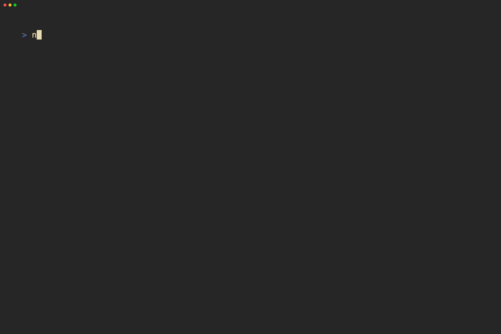

# nono

A nonogram / Picross TUI built with [Ink](https://github.com/vadimdemedes/ink).



# Installation

`nono` requires [Bun](https://bun.com). Follow the official
[Bun installation instructions](https://bun.com/docs/installation) if needed.

With `bun` available, you can install `nono` with the following command.

```sh
bun add -g @jessrenteria/nono
```

# Usage

```sh
nono
```

# Features

- Random puzzle generator
- Level packs
  - Just 5x5 for now, more on the way!
- Level editor
  - Limited to saving a single puzzle for now
